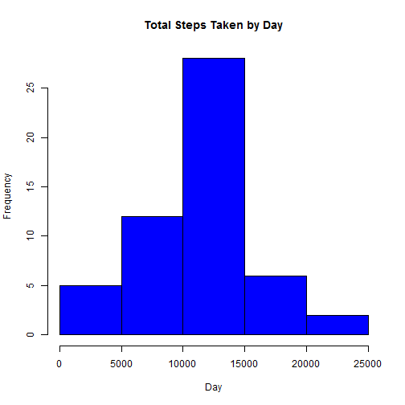
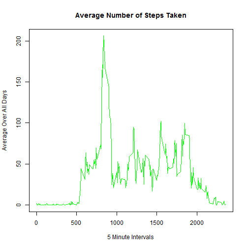
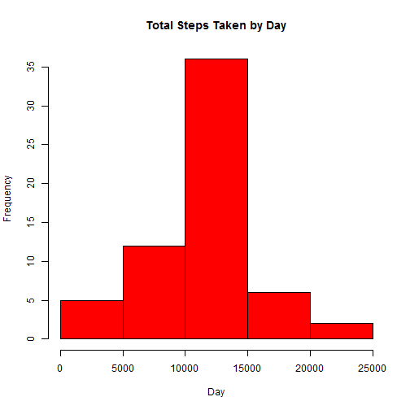

Peer Assessment 1
=================

This assignment loads the activity dataset and does some basic plots and manipulation.

First, loading the data


```r
library(knitr)
library(ggplot2)
library(data.table)
dataset <- read.csv('activity.csv', header=TRUE, colClasses = c("numeric", "character","numeric"))
head(dataset)
```

```
##   steps       date interval
## 1    NA 2012-10-01        0
## 2    NA 2012-10-01        5
## 3    NA 2012-10-01       10
## 4    NA 2012-10-01       15
## 5    NA 2012-10-01       20
## 6    NA 2012-10-01       25
```

Then change date to date formatted variable

```r
library(lattice)
dataset$date<-as.Date(dataset$date, "%Y-%m-%d")
```

Step 1 Finding the mean total number of steps taken per day and plotting a histgram.
Also, outputting the mean and median number of steps

```r
TotSteps <- aggregate(steps ~ date, data = dataset, sum, na.rm = TRUE)
hist(TotSteps$steps, main = "Total Steps Taken by Day", xlab = "Day", col = "blue")
```

 

```r
mean(TotSteps$steps)
```

```
## [1] 10766.19
```

```r
median(TotSteps$steps)
```

```
## [1] 10765
```

Step 2 Average daily activity plot, and which five minute interval was most active

```r
timeplot <- tapply(dataset$steps, dataset$interval, mean, na.rm = TRUE)
plot(row.names(timeplot), timeplot, type = "l", xlab = "5 Minute Intervals", 
    ylab = "Average Over All Days", main = "Average Number of Steps Taken", 
    col = "green")
```

 

```r
maxInterval <- which.max(timeplot)
names(maxInterval)
```

```
## [1] "835"
```

Step 3 Imputing missing values 
Calculate and report number of missing values
Create a new dataset without those missing values using a simple strategy
Run Step 1 on new dataset to compare outcomes

```r
datasetNA <- sum(is.na(dataset))
datasetNA
```

```
## [1] 2304
```

```r
AveSteps <- aggregate(steps ~ interval, data = dataset, FUN = mean)
fill <- numeric()
for (i in 1:nrow(dataset)) {
    obs <- dataset[i, ]
    if (is.na(obs$steps)) {
        steps <- subset(AveSteps, interval == obs$interval)$steps
    } else {
        steps <- obs$steps
    }
    fill <- c(fill, steps)
}

newDataset <- dataset
newDataset$steps <- fill

TotSteps2 <- aggregate(steps ~ date, data = newDataset, sum, na.rm = TRUE)
hist(TotSteps2$steps, main = "Total Steps Taken by Day", xlab = "Day", col = "red")
```

 

```r
mean(TotSteps2$steps)
```

```
## [1] 10766.19
```

```r
median(TotSteps2$steps)
```

```
## [1] 10766.19
```

Step 4 Activity patterns of weekdays vs weekends using a two tier plot and the weekday() function

```r
dayoftheweek <- weekdays(dataset$date)
dayKind <- vector()
for (i in 1:nrow(dataset)) {
    if (dayoftheweek[i] == "Saturday") {
        dayKind[i] <- "Weekend"
    } else if (dayoftheweek[i] == "Sunday") {
        dayKind[i] <- "Weekend"
    } else {
        dayKind[i] <- "Weekday"
    }
}
dataset$dayKind <- dayKind
dataset$dayKind <- factor(dataset$dayKind)

stepsByDayKind <- aggregate(steps ~ interval + dayKind, data = dataset, mean)
names(stepsByDayKind) <- c("interval", "dayKind", "steps")

xyplot(steps ~ interval | dayKind, stepsByDayKind, type = "l", layout = c(1, 2), 
    xlab = "Interval", ylab = "Number of steps")
```

 
